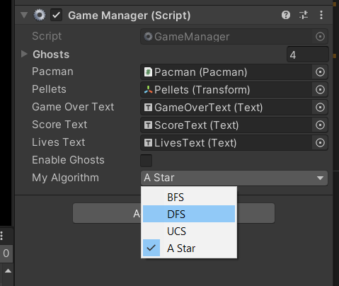

## Pac-man (2D) - TEAM 13

In this project, we implemented search algorithms that determine pacman's movement in the old classic pacman game.
To run the project, clone this repo, import the project into Unity. Open the pacman scene from the assets/scenes folder.  

The search algoritm can be selected in the pacman scene's GameManager inspector. The game can be run by pressing the play button.

DFS:

BFS:

UCS:

A*:

The 2D game components are imported from this open source repository: https://github.com/zigurous/unity-pacman-tutorial
